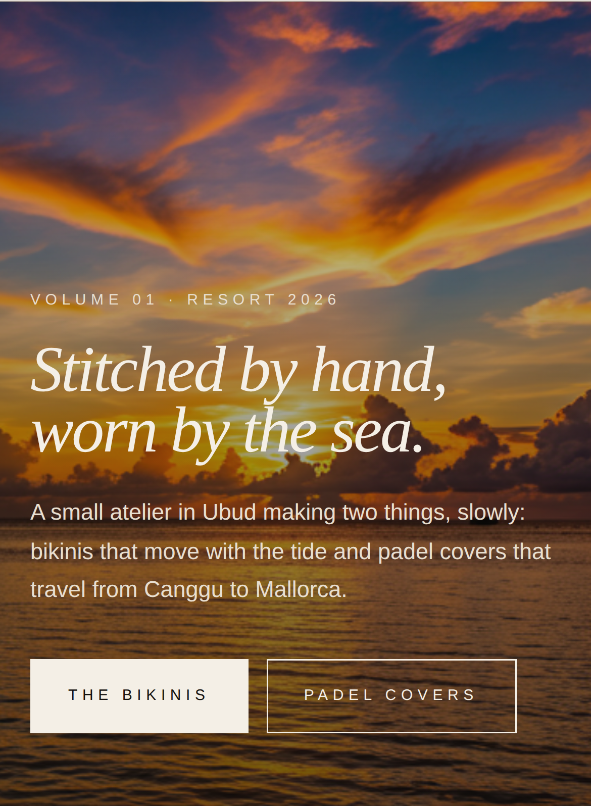
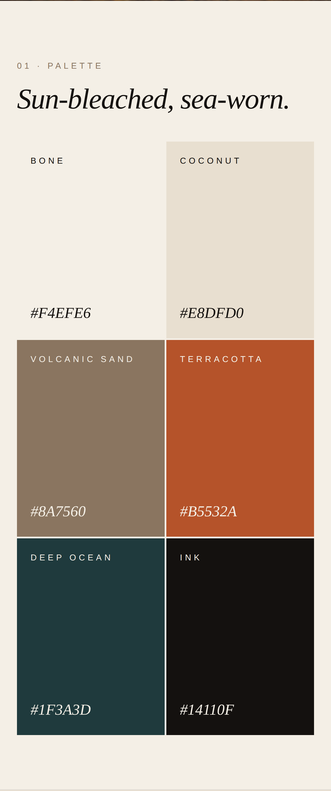
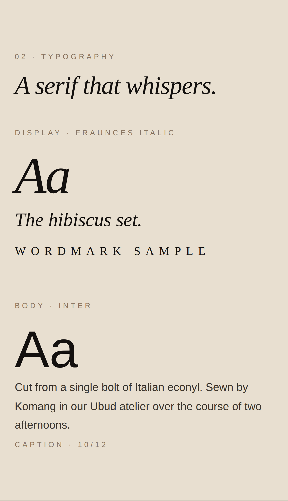
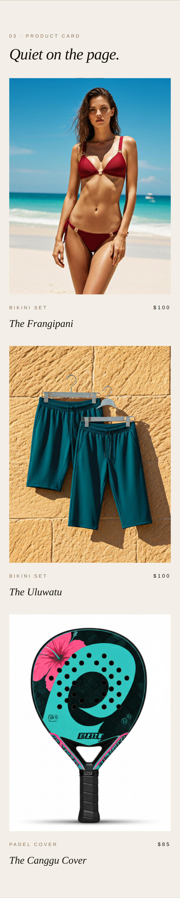
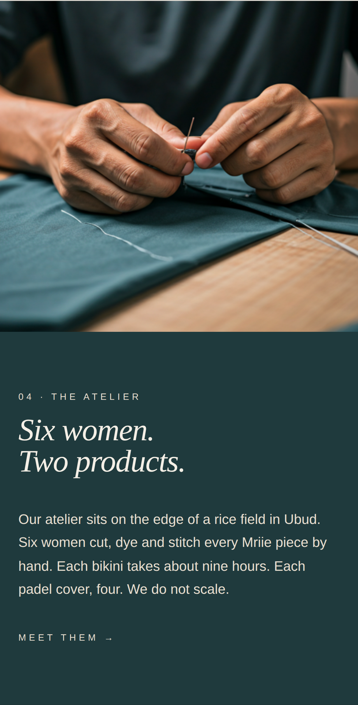
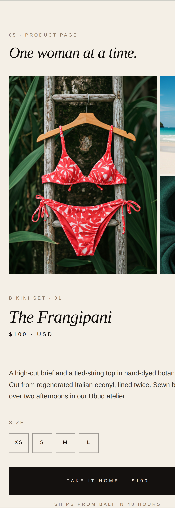
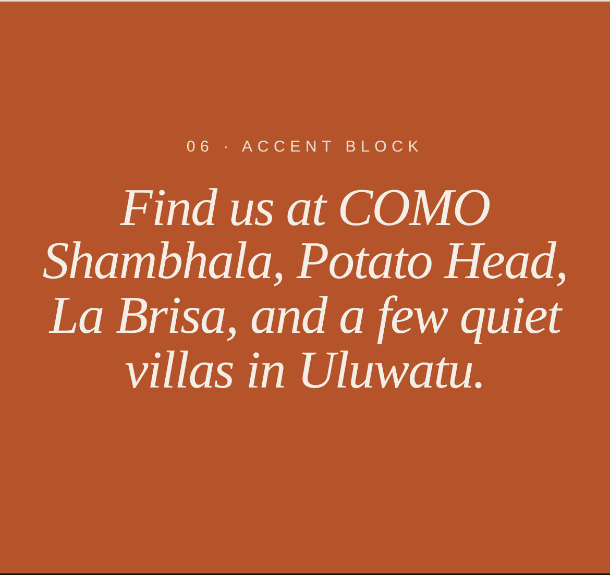
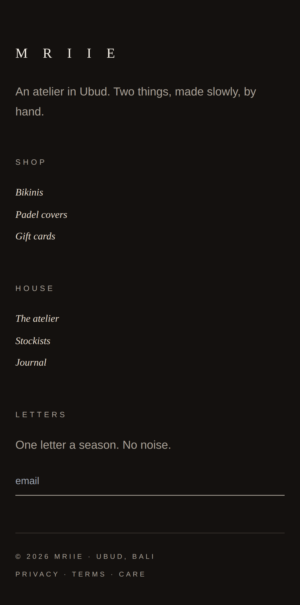

# Mriie — Sun-Bleached Atelier · Design Preview

Mobile mockups of the proposed redesign. Scroll.

## 01 — Hero

Full-bleed Bali coastline. Italic display serif. Two CTAs: *The bikinis* / *Padel covers*.

---

## 02 — Palette

Six colors, nothing more. Bone, Coconut, Volcanic Sand, Terracotta, Deep Ocean, Ink.

---

## 03 — Typography

Fraunces italic for display. Inter for body. Quiet, editorial, expensive.

---

## 04 — Product cards

Tall 3:4 photos. Kind label in tracked caps. Name in italic serif. Price in tracked caps.

---

## 05 — The atelier

Deep Ocean block. Artisan's hands, needle, fabric. *Six women. Two products.*

---

## 06 — Product detail

One image cluster, one column of information. Italic serif title. *Take it home — $100.*

---

## 07 — Accent block

Terracotta, centered italic. *Find us at COMO Shambhala, Potato Head, La Brisa, and a few quiet villas in Uluwatu.*

---

## 08 — Footer

Ink black. Shop / House / Letters. Email input as a single bottom-bordered line.

